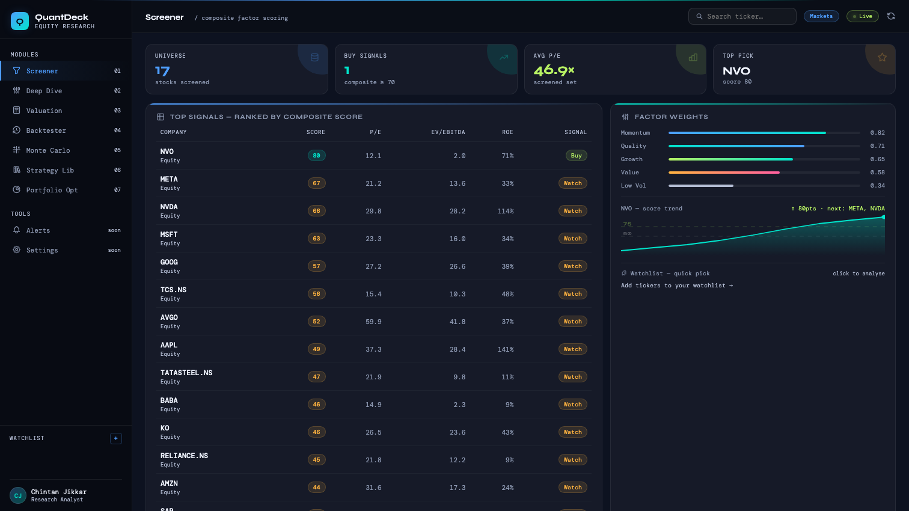

<div align="center">

# QuantDeck

**An institutional-style equity research terminal that runs on your laptop.**

Walk in with a ticker, walk out with a full investment thesis — screen, dissect, value, simulate, backtest, and optimize, all from one dark-mode dashboard wired to live market data.

`FastAPI` · `Vanilla JS` · `Plotly.js` · `yfinance` · `NumPy / pandas / SciPy`

[](https://github.com/chintan-jikkar/QuantDeck/actions/workflows/tests.yml)

</div>

---

## What it is

QuantDeck is a single-page research workstation backed by a thin Python API. The browser renders a seven-module "terminal" (DM Mono + Syne, blue/cyan/lime on near-black); the backend turns each module into one JSON endpoint that reuses a set of pure-Python quant **layers**. There is no database, no build step, and no paid API key — every number is pulled live from Yahoo Finance at request time and cached in-process for an hour.

It is built by a finance analyst, for analysts: the complexity lives in the financial logic (Damodaran WACC, Beneish M-Score, GARCH paths, Markowitz frontiers), not in the infrastructure.

> **Not financial advice.** Every signal, valuation, and backtest is a model output. See [Disclaimers](#disclaimers).



---

## The seven modules

| # | Module | What it answers | Endpoint |
|---|--------|-----------------|----------|
| 01 | **Screener** | "Which names in my universe rank best right now?" | `GET /api/screener` |
| 02 | **Deep Dive** | "Is this one company healthy?" | `GET /api/deep-dive/{ticker}` + `GET /api/prices/{ticker}` |
| 03 | **Valuation** | "What is it worth?" | `GET /api/valuation/{ticker}` |
| 04 | **Backtester** | "Would this strategy have worked?" | `GET /api/backtest` |
| 05 | **Monte Carlo** | "What's the range of outcomes?" | `GET /api/simulation/{ticker}` |
| 06 | **Strategy Library** | "Which strategy fits this name?" | `GET /api/strategies` |
| 07 | **Portfolio Optimizer** | "How should I weight a basket?" | `GET /api/portfolio` |

A **shared ticker flow** stitches them together: pick a name in the Screener (or the top-bar search), and it carries through Deep Dive → Valuation → Backtester → Monte Carlo automatically.

### 01 · Screener
Composite-score ranking of a global basket (US mega-caps, India `.NS`, EU, Korea `.KS`). Each row is colour-coded Buy / Watch / Avoid. A **daily Top Pick** rotates without repeating (persisted in `localStorage`), with factor-weight bars and a watchlist quick-pick strip.

### 02 · Deep Dive
Interactive **Plotly candlestick** (Chinese convention: red = up, green = down) with 1m→1M timeframes and SMA/EMA/Bollinger/trend overlays. Alongside it: KPI cards, a fundamentals snapshot, a dual-axis revenue & margin chart, an auto-generated bull/bear **investment memo** (gross margin, revenue trend, Beneish M-Score, yield-curve shape), sector & macro context, live analyst consensus, **recent news with article summaries**, a **financial-documents panel** (EDGAR 10-K/10-Q, transcripts, or NSE/BSE/Screener.in for Indian names), and a one-click **watchlist toggle**.

### 03 · Valuation
Country-correct **DCF** (`Ke = Rf + β·ERP + CRP` across 12 markets), a WACC-components breakdown, a bear/base/bull football-field, and a multi-method summary (DCF, comps-implied P/E & EV/EBITDA, DDM) each shown versus the current price.

### 04 · Backtester
Full tearsheet (Total Return, Sharpe, Sortino, Max Drawdown, Win Rate, CAGR) with a **Plotly equity curve** — lime ▲ entries, pink ▼ exits, dashed benchmark overlay — a trade log, and a monthly-returns heatmap.

### 05 · Monte Carlo
Animated percentile cone (P10–P90 fan + sample paths drawn progressively) under **GBM**, **GARCH-t**, or **Ornstein-Uhlenbeck** models, a return-distribution histogram, VaR/CVaR risk metrics, and an **MC-derived trade setup** (entry / stop / 90-day target / risk-reward).

### 06 · Strategy Library
Every registered strategy back-tested live on the active ticker, ranked by Sharpe, each card carrying a BUY / HOLD / AVOID verdict. Click a card to load it straight into the Backtester.

### 07 · Portfolio Optimizer
Markowitz max-Sharpe optimization over a **persistent basket** (saved in `localStorage`). Optimal-weight bars, an efficient-frontier scatter with min-vol/max-Sharpe markers, a correlation heatmap, a per-position risk label (β/σ/weight), and an inline **buy-date/price/qty tracker** per holding.

---

## Architecture

```
Browser (frontend/)                         Python (api/ + layers/)
┌───────────────────────────┐               ┌──────────────────────────────┐
│ index.html  — all markup  │   fetch()     │ api/main.py   — FastAPI       │
│ js/app.js   — all wiring  │ ───────────▶  │   /api/* JSON endpoints       │
│ Plotly.js   — all charts  │ ◀───────────  │   serves frontend/ statically │
│ localStorage — UI state   │   JSON        │ api/serialize.py — JSON-safe  │
└───────────────────────────┘               └──────────────┬───────────────┘
                                                            │ imports
                                             ┌──────────────▼───────────────┐
                                             │ layers/   pure quant logic    │
                                             │  screener · deep_dive ·       │
                                             │  valuation · simulation ·     │
                                             │  backtester · decision        │
                                             ├───────────────────────────────┤
                                             │ data/     yfinance · FRED      │
                                             │ strategies/  pluggable signals │
                                             │ config.py  universes + risk    │
                                             └───────────────────────────────┘
```

**Core design rule:** `layers/` and `strategies/` import zero web/UI code. They take parameters and return DataFrames and numbers, so each is independently readable and unit-tested. `api/main.py` is a thin translation layer; `frontend/` is pure display.

For the full request lifecycle, module internals, and the financial math, see **[docs/ARCHITECTURE.md](docs/ARCHITECTURE.md)**. For every endpoint's parameters and response shape, see **[docs/API_REFERENCE.md](docs/API_REFERENCE.md)**.

```
QuantDeck/
├── api/
│   ├── main.py            # FastAPI app: all /api/* endpoints + static mount
│   └── serialize.py       # to_jsonable(): DataFrame/ndarray/NaN → JSON-safe
├── frontend/
│   ├── index.html         # the entire UI (markup + CSS, single file)
│   └── js/app.js          # all wiring: loaders, charts, shared-ticker flow
├── layers/                # pure-Python quant logic (no web imports)
│   ├── screener.py        # composite scoring + filters
│   ├── deep_dive.py       # margins, earnings quality, Beneish M-Score
│   ├── valuation.py       # DCF, WACC, DDM, comps
│   ├── simulation.py      # GBM / GARCH-t / OU Monte Carlo
│   ├── backtester.py      # engine + tearsheet metrics
│   └── decision.py        # cross-layer reward/risk signal (library-only)
├── strategies/            # pluggable Strategy subclasses (signal/factor/arb)
├── data/                  # fetch layer: prices, fundamentals, macro, fx, news
├── utils/                 # watchlist, formatting, charts, calendar
├── config.py              # universes, COUNTRY_RISK, benchmark map
├── tests/                 # 235 pytest functions over the math
├── pages/ · app.py        # retired Streamlit UI (kept for reference)
└── docs/                  # ARCHITECTURE, API_REFERENCE, design mockups
```

---

## Quick start

```bash
git clone https://github.com/chintan-jikkar/QuantDeck.git
cd QuantDeck
pip install -r requirements.txt

uvicorn api.main:app --port 8000
# open http://localhost:8000  (hard-refresh once: Cmd/Ctrl + Shift + R)
```

On macOS you can also double-click **`start_quantdeck.command`** to launch and **`stop_quantdeck.command`** to stop.

**No API keys required.** Fundamentals, prices, news, and analyst data all come from yfinance (Yahoo Finance) — no key, no rate-limit tier, global coverage. The risk-free rate used in valuation is a per-country proxy because live FRED calls are slow; everything else is fetched live.

### Asset universe

| Class | Examples | yfinance format |
|-------|----------|-----------------|
| US equities | `AAPL`, `MSFT`, `NVDA` | bare symbol |
| International equities | `RELIANCE.NS`, `005930.KS`, `SAP`, `ASML` | suffix per exchange |
| FX pairs | `EURUSD=X`, `USDINR=X` | `=X` |
| Commodities | `GC=F`, `CL=F`, `HG=F` | `=F` |

Prices, candles, and Monte Carlo work for every class. Deep Dive and Valuation are equity-only and show a clean not-applicable state otherwise.

---

## Tests

```bash
pytest -q --ignore=tests/test_news.py
```

235 test functions cover the parts that must be correct: WACC/DCF/DDM math, backtester P&L accounting and tearsheet metrics, Monte Carlo path generation and risk metrics, screener filters and scoring, asset-type detection, country helpers, and watchlist persistence. (`test_news.py` hits a live endpoint and is excluded from CI runs.)

---

## Extending it

- **Add a strategy** — subclass `strategies/base.py`, implement `generate_signals(prices_df, **params) -> pd.Series`, register it in `strategies/__init__.py`. The Backtester and Strategy Library pick it up automatically.
- **Add a universe** — add an entry to `config.EQUITY_UNIVERSES` (or `FX_PAIRS` / `COMMODITIES`) with `suffix`, `benchmark`, `market_index`, `country`.
- **Add a country** — add an entry to `config.COUNTRY_RISK` with `rf_ticker`, `erp`, `crp`. Valuation inherits it via `_derive_wacc_inputs`.

---

## Known limitations

These are deliberate scope choices, documented so they don't surprise you:

- **Comparable-company peers are curated, not fetched live.** yfinance has no reliable peer endpoint, so `fetch_peers()` uses a hand-maintained per-ticker map with a sector-bucket fallback. Coverage is good for large-caps but thin for smaller or less common names.
- **The risk-free rate is a proxy, not live FRED.** A recent per-country 10Y yield is substituted to keep Valuation and the Decision signal fast; WACC stays sensible but isn't to-the-basis-point, and the proxy needs periodic manual updates as rates move.
- **The DCF excludes changes in net working capital.** Free cash flow is `NOPAT + D&A − Capex`; for working-capital-heavy sectors (retail, industrials) this can overstate FCF slightly.
- **The Portfolio Optimizer's "max-Sharpe" is approximate.** Weights are found by sampling 5,000 random long-only portfolios rather than solving the tangency portfolio directly, so the reported optimum is close to, but not exactly, the true efficient frontier.
- **First paint shows mockup numbers** for a fraction of a second before live data replaces them.

See [docs/ARCHITECTURE.md](docs/ARCHITECTURE.md#blindspots--roadmap) for the full blindspot register and roadmap.

---

## Disclaimers

QuantDeck is a quantitative-analysis and educational tool. Every signal, valuation, and backtest is a model output, **not financial advice**. Models do not account for gap risk from earnings, regulatory changes, or macro regime shifts. **Backtested performance is not indicative of future results.** Data is sourced from Yahoo Finance on a best-effort basis and may be delayed, incomplete, or revised.
